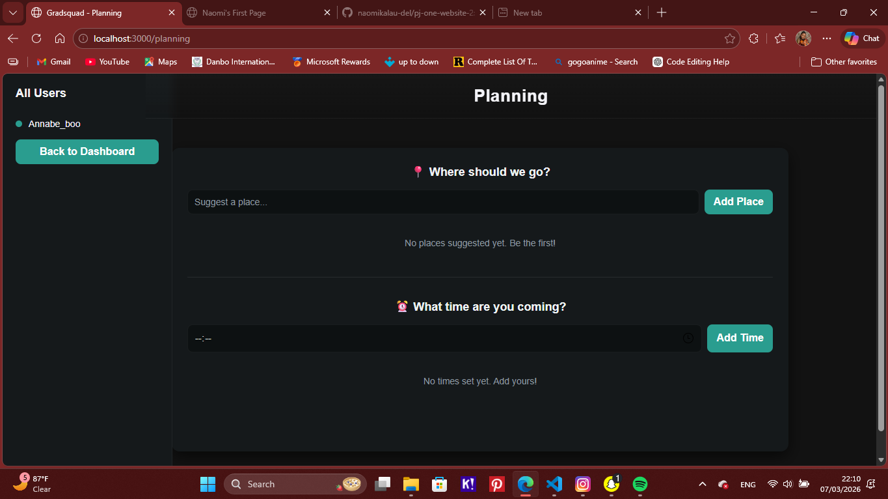

# 🎓 Gradsquad

## 📖 Overview
Gradsquad is a class community web app built for my graduating year.  
It allows classmates to connect, chat, share photos, plan events, and create custom profiles.  
This project is part of my portfolio for Yonsei University, showing creativity, teamwork, and web development skills.

## 🚀 Features
- Custom user profiles
- Chat and messaging system
- Event planning (class outings, birthdays, etc.)
- Photo album sharing
- Calendar integration
- Responsive design for desktop and mobile

## 🛠️ Tech Stack
- HTML, CSS, JavaScript
- PHP (backend logic)
- MySQL (database)
- VS Code + GitHub for collaboration

## 📸 Screenshots

### Home Page

### Dashboard

### Calendar

### Photo Album

### Chat

### Birthday List

### Event Planning

### Settings

# Open with localhost or your preferred server
