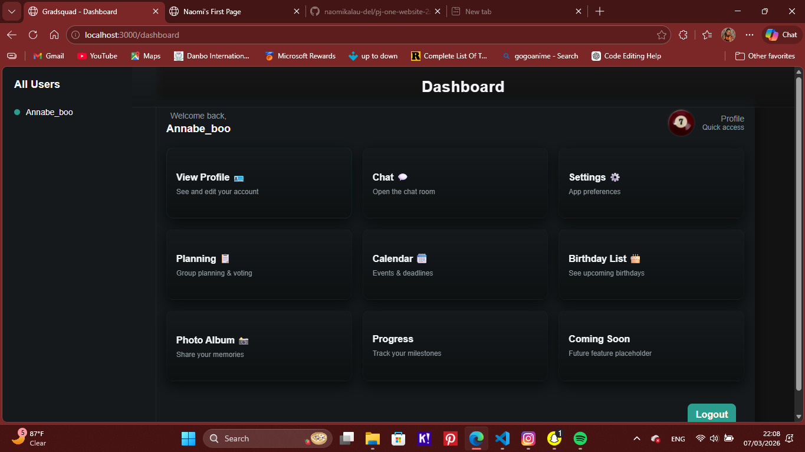

# 🎓 Gradsquad

## 📖 Overview
Gradsquad is a class community web app built for my graduating year.  
It allows classmates to connect, chat, share photos, plan events, and create custom profiles.  
This project is part of my portfolio for Yonsei University, showing creativity, teamwork, and web development skills.

## 🚀 Features
- Custom user profiles
- Chat and messaging system
- Event planning (class outings, birthdays, etc.)
- Photo sharing
- Responsive design for desktop and mobile

## 🛠️ Tech Stack
- HTML, CSS, JavaScript
- PHP (backend logic)
- MySQL (database)
- VS Code + GitHub for collaboration

## 📸 Screenshots
Here’s a preview of Gradsquad so far:



*(Save your screenshot in an `assets/` folder inside the repo, then reference it here.  
You can add more screenshots like `assets/login.png` or `assets/events.png` and stack them below.)*

## 📂 Installation
To run locally:
```bash
git clone https://github.com/naomikalau-del/Gradsquad-project.git
cd Gradsquad-project
# Open with localhost or your preferred server
