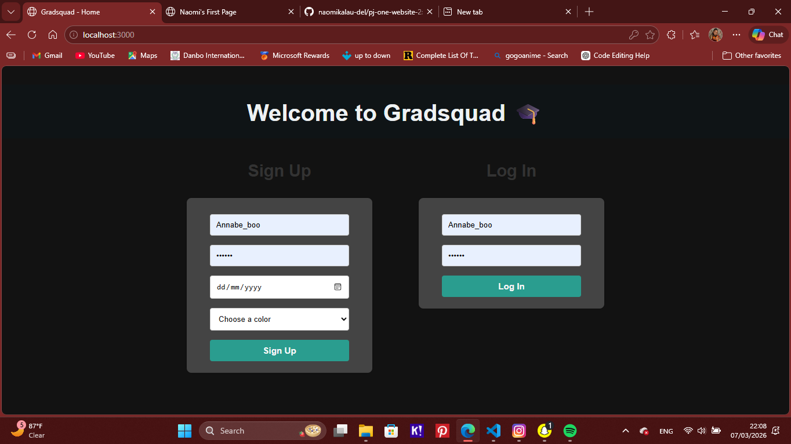
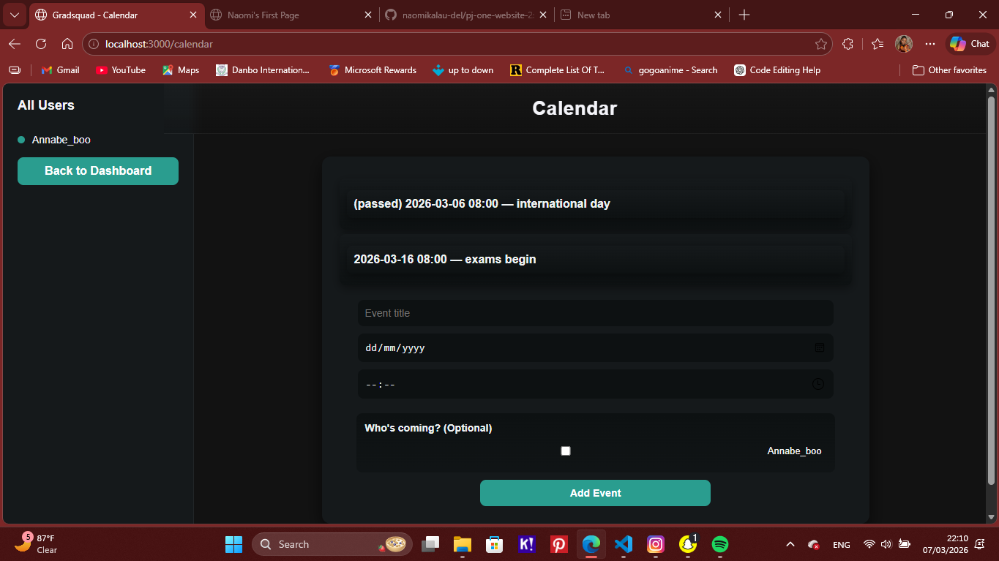
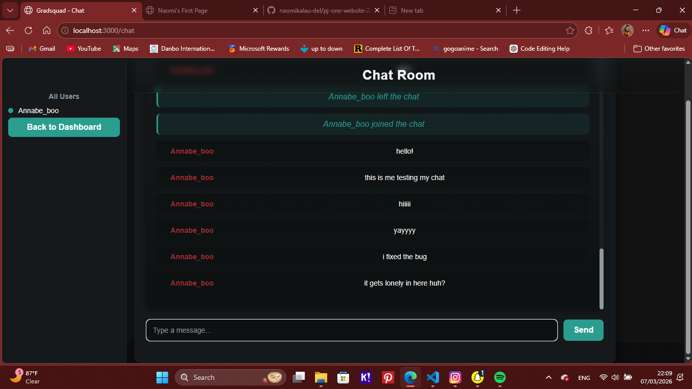
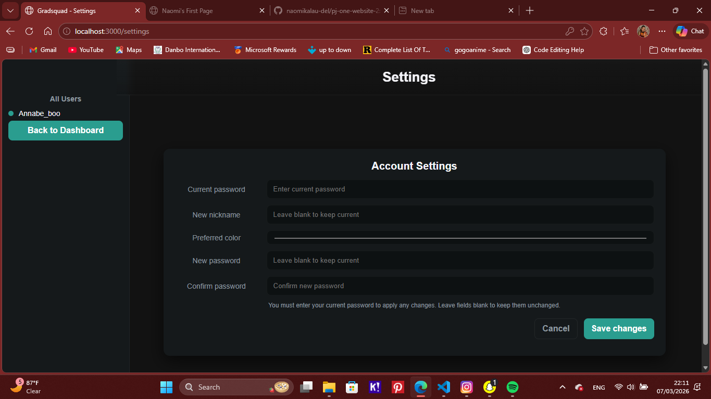
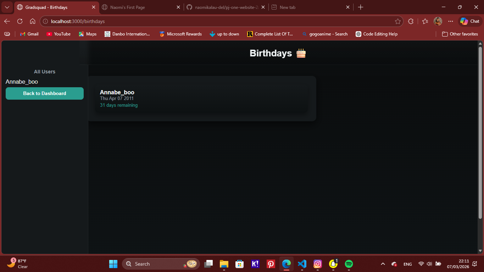
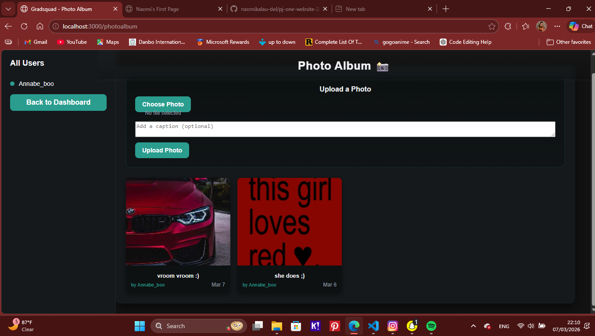

# Project Name

a platform for my classmates and i to connect, plan get-togethers and have fun. 

# Preview

Below are some screenshots of the application interface.

## Home


## Dashboard


## Planner


## Calendar


## Chat


## Profile


## Settings


## Birthday Feature


## Photos


---

# Features

- Event planner
- Calendar integration
- Chat system
- Profile management
- Birthday reminders
- Photo sharing

---

# Installation

Clone the repository:

```bash
git clone https://github.com/naomikalau-del/Gradsquad-project.git
cd Gradsquad-project
# Open with localhost or your preferred server
 your preferred server
